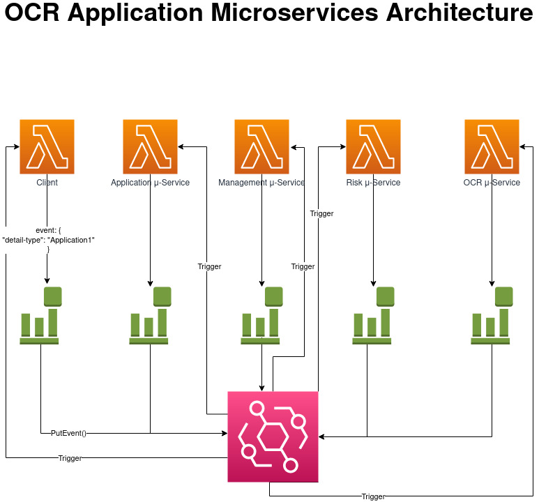
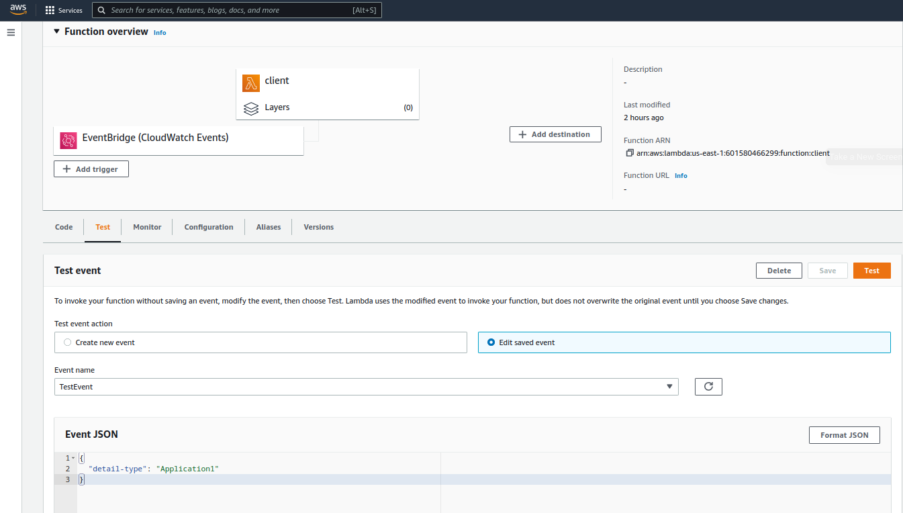
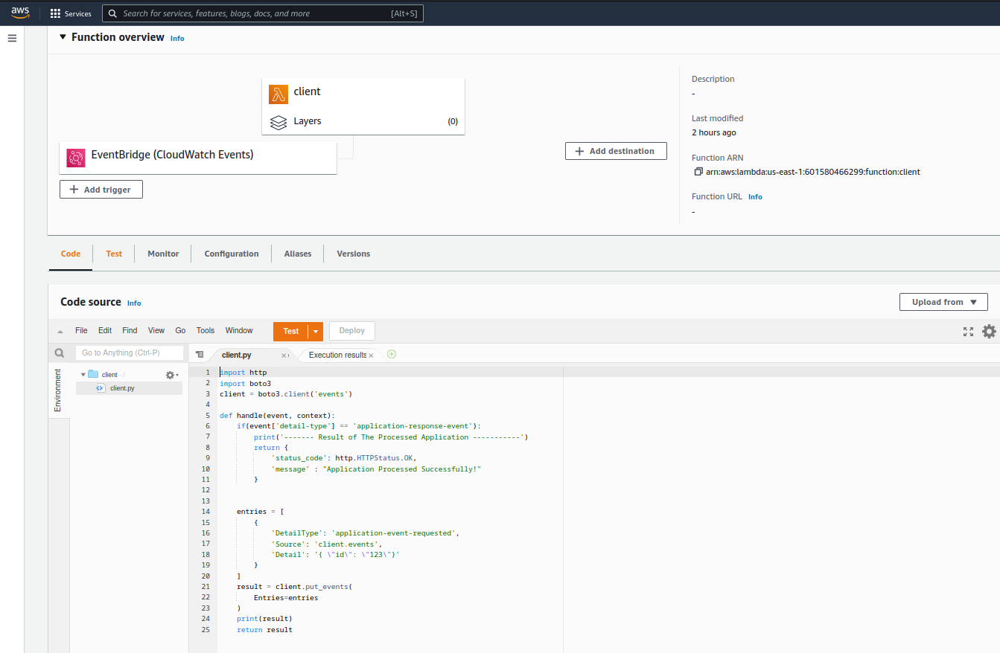
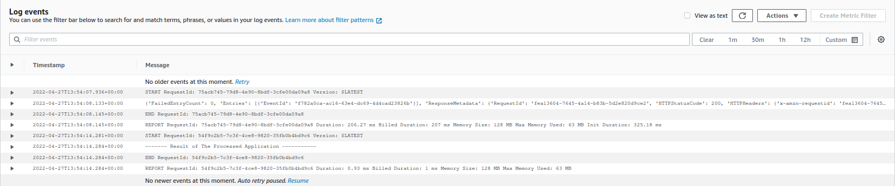

# Serverless Architecture Lab

This a IAC of a serverless architecture using Terraform & AWS.

# Architecture & Workflow
## Architecture

<br><br>
Our application is composed of 5 AWS Lambda functions that communicate between themselves using AWS EventBridge (AWS CloudWatch Events). The type of events rule is "Event Pattern", which means that every Lambda function, except the client one, will only be triggered if a specific event exists in the event-bus. To get more information about event patterns you could have a look on:

```modules/event-bridge/event-bridge.tf```

## Workflow
1- Trigger the client Lambda from the AWS console, using an event that should have an attribute called `detail-type.` Example:
```bash
{
    "detail-type": "Application1"
}
```
2- The client Lambda will put an event in the event bus, which indicates that the Application Lambda should be Triggered.

3- Once Triggered, the Lambda Application will put an event in the event bus, indicating that the Management Lambda should be Triggered.

4- The process will continue sequantially, as shown in the architecture diagram, until the event will trigger the OCR Lambda.

5- Finally, the OCR Lambda will send the result back to the Client Lambda.

**All of the Lambda functions does not have a business logic, because what only matters in this application is the workflow and the architecture. They only treat events, and put events in the event bus.**
# Installing The Application
## Prerequisite
- Terraform installed on your host machine. To check that, run this command:
```bash
$ terraform --version
```
- AWS profile configured on your host machine, so that terraform could connect to your account. 
**PLEASE DO NOT USE YOUR ROOT ACCOUNT!**

## Installing Steps
1- Initializing the terraform working directory using this command:
```bash
$ terraform init
```
2- Deploy your application by running the following command:
```bash
$ terraform plan -auto-approve
```
## Clean-up
To clean-up your deployed infrastructure, run the following command:
```bash
$ terraform destroy -auto-approve
```

# Application In Action
1- Add a test event to the Client Lambda function.<br><br>

<br><br>
2- Trigger the Client Lambda function.<br><br>

<br><br>
3- Check the logs of Client Lambda function, you should see ```---- Result of The Processed Application ----```<br><br>

<br><br>
4- Check the Other Lambda function logs, To see the events being processed.